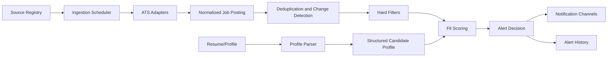

# System Architecture

## Architecture Style

Use a modular monolith for V1 unless the existing codebase already has a different direction. The system should be split by domain boundaries, but deployed as one application to keep iteration fast.

Recommended modules:

- Profile: resume parsing, user preferences, extracted user facts.
- Sources: company and ATS source configuration.
- Ingestion: polling, fetching, parsing, normalization.
- Jobs: canonical job records, duplicate detection, change detection.
- Matching: hard filters, scoring, explanation generation.
- Alerts: notification routing, throttling, delivery history.
- Admin/Debug: source health, recent jobs, match traces, failed fetches.

## High-Level Flow

## Core Services

### Profile Parser

Responsibilities:

- Accept pasted resume text, PDF-extracted text, or Markdown.
- Extract roles, employers, dates, skills, tools, projects, education, links, domains, and seniority signals.
- Preserve original resume text for traceability if the user consents.
- Produce a structured `CandidateProfile`.

### Source Registry

Responsibilities:

- Store monitored companies and source URLs.
- Identify ATS provider when possible.
- Track source health, fetch interval, last success, and error state.
- Allow users to pause or delete sources.

### Ingestion Scheduler

Responsibilities:

- Schedule fetch jobs per source.
- Respect source-specific backoff and rate limits.
- Avoid overlapping fetches for the same source.
- Emit normalized job posting candidates.

Recommended intervals:

- High-priority target companies: every 5 to 15 minutes when safe.
- Normal sources: every 30 to 60 minutes.
- Failing sources: exponential backoff.

### ATS Adapters

Responsibilities:

- Fetch source-specific job lists.
- Parse provider-specific fields.
- Normalize into `JobPosting`.
- Preserve raw payload or raw HTML snapshot for debugging when allowed.

V1 adapters should focus on providers with accessible public feeds:

- Greenhouse.
- Lever.
- Ashby.

Add Workday after the basic adapter model is stable because Workday implementations vary significantly by tenant.

### Deduplication and Change Detection

Responsibilities:

- Generate a stable fingerprint for each job.
- Detect new jobs.
- Detect meaningful updates to existing jobs.
- Avoid duplicate alerts across the same company and source.

Deduplication should use a layered strategy:

- Provider job ID when available.
- Canonical URL.
- Company + normalized title + normalized location.
- Content hash for change detection.

### Matching Engine

Responsibilities:

- Apply hard filters.
- Score remaining jobs from 0 to 100.
- Generate concise reasons and missing requirements.
- Store a match trace for debugging.

Use deterministic rules first, then optional LLM assistance for nuanced reasoning. Do not make the LLM the only source of truth for hard filters.

### Alert Service

Responsibilities:

- Decide whether a job should alert immediately.
- Format alerts for email, Slack, Discord, SMS, push, or in-app.
- Store delivery attempts.
- Prevent repeated alerts for the same job unless the job meaningfully changes.

## Suggested Runtime Jobs

- `parse_resume`: runs when user updates profile.
- `discover_sources`: validates and classifies source URLs.
- `poll_source`: fetches a source on schedule.
- `normalize_jobs`: turns provider payloads into canonical records.
- `score_job`: compares one job to one user profile.
- `send_alert`: delivers notification and records result.
- `source_health_check`: reports broken or stale sources.

## Data Storage

Use a relational database for V1. PostgreSQL is preferred because the app will need constraints, JSON payloads, indexes, and full-text/vector extensions later.

Recommended:

- Postgres for application data.
- Redis or database-backed queue for scheduled jobs.
- Object storage only if storing original resumes or raw snapshots.

## Reliability Requirements

- A failed source fetch must not stop other sources.
- A failed match explanation must not lose the normalized job.
- Alert sending should be retryable and idempotent.
- Job detection must tolerate missing fields.
- Scheduler state must survive app restarts.

## Security and Privacy

- Resume content is sensitive. Treat it as private user data.
- Encrypt sensitive data at rest if supported by the stack.
- Never log full resumes or full access tokens.
- Keep notification messages concise and avoid exposing sensitive resume details.
- Provide a delete-user-data path early.

